# AI Co-Founder Platform: System Architecture Specification

> **Status**: Approved Architecture Baseline  
> **Target Topology**: LangGraph-Native Monolith (In-Process Domain Modules)  
> **Runtime Environment**: Python 3.11+, FastAPI, LangGraph, PostgreSQL 15, Redis 7, ChromaDB  
> **Frontend**: Next.js 14 (App Router), TypeScript, Tailwind CSS, SSE Streaming  
> **Team Context**: QuadNova (University of Moratuwa) — 5 Domain Owners  

---

## 1. Executive Overview & Design Philosophy

The **AI Co-Founder Platform** is an intelligent, multi-agent orchestration system designed to assist early-stage startup founders in transforming raw concepts into validated, investor-ready venture plans. Operating as a virtual co-founding team, the platform deconstructs business ideas, conducts empirical market research, evaluates market viability, constructs business models, computes deterministic 12-to-36-month financial forecasts, formulates go-to-market strategies, and synthesizes an actionable startup roadmap.

```
+-----------------------------------------------------------------------------------------------+
|                                    CORE DESIGN PHILOSOPHIES                                   |
+------------------------------------+------------------------------------+---------------------+
| 1. Determinism over Hallucination   | 2. Evidence Grounding & Citations  | 3. Stateful Healing |
| Financial math & boundary checks   | Every factual claim in market      | Incremental targeted|
| execute in pure Python/NumPy, not  | research must be backed by verified| replanning guided by|
| stochastic LLM arithmetic.         | external sources (100% target).    | multi-tier critics. |
+------------------------------------+------------------------------------+---------------------+
| 4. Human-in-the-Loop Safety Net    | 5. Strict Domain Modularity        | 6. Unified Monolith |
| Hard limit of 5 replans triggers   | 5 team members own clean domains   | Single FastAPI app  |
| structured human review pause node | exposing strict interfaces; state  | hosts all agents; zero|
| via dedicated REST resume API.     | passes solely via VentureState.    | RPC overhead.       |
+------------------------------------+------------------------------------+---------------------+
```

### 1.1 Core Tenets
1. **Determinism over Hallucination**: Large Language Models extract qualitative parameters and assumptions from unstructured data, but all quantitative projections (MRR, ARR, CAC, LTV, Runway, Burn Rate) execute inside a deterministic Python math engine with hard boundary invariants ($SOM \le SAM \le TAM$, positive margins).
2. **Evidence-Grounded Validation**: Factual statements generated by research agents must cite real-world web sources. The Critic agent enforces a strict validation rubric (Confidence $\ge 0.70$, $\ge 2$ verified citations, zero ungrounded high-impact claims).
3. **Stateful Self-Healing & Targeted Re-planning**: Failure to meet validation criteria triggers localized re-execution of only the failing node, preserving upstream work while passing accumulated critique history to avoid cyclic oscillations.
4. **Human-in-the-Loop (HITL) Safeguards**: If automated re-planning exceeds a hard ceiling (5 attempts) or detects fundamental viability contradictions, execution suspends cleanly into a pause node until the founder reviews and provides explicit direction via the API.
5. **Strict Domain Modularity for Team DX**: In a 5-member engineering team, each domain (`services/<domain>`) remains strictly encapsulated behind an `app/interface.py` boundary, allowing independent development and unit testing via editable installs (`pip install -e`).

---

## 2. System Architecture & Topology

### 2.1 Monolithic LangGraph Runtime Topology
The platform operates as a **LangGraph-Native Monolith**. Rather than deploying 5 microservices communicating over HTTP/gRPC (which introduces distributed transaction failures, serialization latency, and complex deployment coordination for an academic team), the Orchestrator hosts the complete LangGraph state machine in a single FastAPI process. 

Domain directories (`services/business-intelligence`, `services/research`, `services/finance`, `services/marketing-output`) function as in-process Python modules. Cross-domain interactions occur strictly through the shared [`VentureState`](file:///home/savindust/Documents/projects/ai-co-founder/ai-cofounder/shared/contracts/venture_state.py) contract.

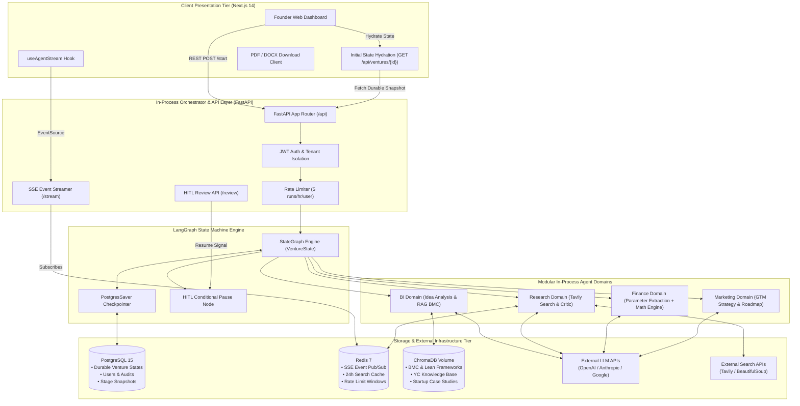

### 2.2 Container Deployment Architecture
The entire stack deploys through a streamlined [`docker-compose.yml`](file:///home/savindust/Documents/projects/ai-co-founder/ai-cofounder/docker-compose.yml) comprising 4 containers:

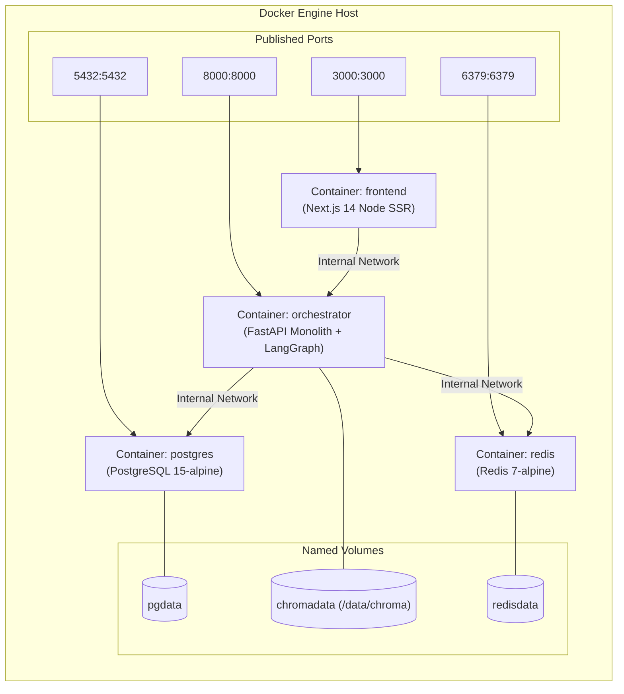

---

## 3. Multi-Agent Workflow & State Machine

The workflow represents an end-to-end directed cyclic graph executed by LangGraph, mapping directly to the founder's initial specification with targeted replanning loops and HITL controls.

```mermaid
flowchart TD
    Start([Founder Submits Input<br/>POST /api/ventures/start]) --> InitNode[Initialize VentureState<br/>Stage: INITIALIZED]
    InitNode --> Checkpoint1[(Checkpoint Snapshot)]
    
    Checkpoint1 --> IdeaNode[Idea Analysis Agent<br/>• Value Proposition Deconstruction<br/>• Target Audience & Unfair Advantage<br/>• Key Hypothesis Extraction]
    IdeaNode --> Checkpoint2[(Checkpoint Snapshot)]

    Checkpoint2 --> MarketNode[Market Research Agent<br/>• Tavily Web Search & Competitor Scraping<br/>• TAM / SAM / SOM Sizing<br/>• Industry Growth & Barrier Analysis]
    MarketNode --> Checkpoint3[(Checkpoint Snapshot)]

    Checkpoint3 --> CriticNode[Critic / Evidence Validation Agent<br/>• Score Confidence 0.0 - 1.0<br/>• Fact-Check Claims vs Sources<br/>• Validate Source Citations Count]
    CriticNode --> Checkpoint4[(Checkpoint Snapshot)]

    CriticNode --> CriticDecision{Critic Rubric:<br/>Score >= 0.70 &<br/>Sources >= 2 &<br/>Ungrounded = 0?}

    %% Critic Re-planning Branch
    CriticDecision -- No: Weak / Low Confidence --> CheckReplanLimit{Total Replans<br/>> 5?}
    
    CheckReplanLimit -- Yes --> HITLNode[Human-in-the-Loop Pause Node<br/>• Broadcast HITL_REQUIRED SSE<br/>• Suspend LangGraph Execution]
    HITLNode --> FounderReviewAction{Founder Action via<br/>POST /api/ventures/{id}/review}
    FounderReviewAction -- PROCEED_ANYWAY --> BMNode
    FounderReviewAction -- OVERRIDE_ASSUMPTIONS --> MarketNode
    FounderReviewAction -- ABORT --> FailNode([Workflow FAILED])

    CheckReplanLimit -- No --> ReplanRouter{Re-planning<br/>Target?}
    ReplanRouter -- Unsound Foundation --> ReplanIdea[Append Critique to History<br/>Increment replan_count<br/>Stage: REPLANNING] --> IdeaNode
    ReplanRouter -- Insufficient Evidence --> ReplanMarket[Append Critique to History<br/>Increment replan_count<br/>Stage: REPLANNING] --> MarketNode

    %% Business Model Branch
    CriticDecision -- Yes: Validated --> BMNode[Business Model Agent - RAG<br/>• Query ChromaDB BMC / Lean Canvas<br/>• Synthesize 9 Canvas Blocks<br/>• Identify Value Stream & Cost Centers]
    BMNode --> Checkpoint5[(Checkpoint Snapshot)]

    %% Revenue Branch
    Checkpoint5 --> RevParamNode[Revenue Parameter Extraction<br/>• Extract Pricing Tiers & Unit Economics<br/>• Customer Acquisition Cost Estimates<br/>• Initial Churn & Margin Assumptions]
    RevParamNode --> RevMathNode[Deterministic Financial Engine<br/>• Pure Python/NumPy Projection<br/>• 12-Month Conservative/Mod/Opt<br/>• Evaluate Boundary Invariants]
    RevMathNode --> Checkpoint6[(Checkpoint Snapshot)]

    RevMathNode --> RevInvariantCheck{Financial Invariants:<br/>SOM <= SAM <= TAM &<br/>Margins > 0 &<br/>LTV/CAC >= 3.0?}

    %% Revenue Loopback Branch
    RevInvariantCheck -- Invariant Violation --> RevLoopCheck{Internal Retune<br/>Count <= 2?}
    RevLoopCheck -- Yes --> RetuneNode[Tier 1: Internal Retune<br/>Adjust Pricing & Cost Assumptions<br/>Increment finance_retune_count] --> RevParamNode
    RevLoopCheck -- No: Deep Discrepancy --> MacroLoopCheck{Total Replans<br/>> 5?}
    MacroLoopCheck -- Yes --> HITLNode
    MacroLoopCheck -- No --> MacroReplan[Tier 2: Macro Loopback<br/>Append Financial Notes to Critique<br/>Stage: REPLANNING] --> MarketNode

    %% Marketing & Roadmap Branch
    RevInvariantCheck -- Invariants Pass --> MarketingNode[Marketing & GTM Agent<br/>• Channel Acquisition Strategy<br/>• Conversion Funnel Metrics<br/>• 90-Day Launch Campaign Milestones]
    MarketingNode --> Checkpoint7[(Checkpoint Snapshot)]

    Checkpoint7 --> RoadmapNode[Startup Roadmap Synthesis<br/>• Consolidate Cross-Agent Findings<br/>• Phase 1-4 Milestone Matrix<br/>• Risk Mitigation & Executive Summary]
    RoadmapNode --> Checkpoint8[(Checkpoint Snapshot)]

    Checkpoint8 --> CompleteNode([Stage: COMPLETED<br/>Emit ROADMAP_READY Event<br/>Ready for UI / PDF / DOCX Export])
```

### 3.1 State Transitions & Workflow Stages
The system transitions through discrete stages defined in [`WorkflowStage`](file:///home/savindust/Documents/projects/ai-co-founder/ai-cofounder/shared/enums/workflow_status.py):

| WorkflowStage | Preceding Stage | Trigger Condition | Output State Field Populated |
| :--- | :--- | :--- | :--- |
| `INITIALIZED` | None | `POST /api/ventures/start` | `founder_input` |
| `IDEA_ANALYSIS` | `INITIALIZED` or `REPLANNING` | State machine entry | `idea_analysis` |
| `MARKET_RESEARCH` | `IDEA_ANALYSIS` or `REPLANNING` | Idea analysis complete | `market_research` |
| `CRITIC_VALIDATION` | `MARKET_RESEARCH` | Research complete | `market_validation`, `critique_history` |
| `REPLANNING` | `CRITIC_VALIDATION` or `REVENUE_ESTIMATION` | Validation failed or financial invariant breach | Updates `retry_counts`, `critique_history` |
| `BUSINESS_MODEL` | `CRITIC_VALIDATION` or HITL override | Critic passes validation rubric | `business_model` |
| `REVENUE_ESTIMATION` | `BUSINESS_MODEL` | Business model synthesized | `revenue_estimation` |
| `MARKETING` | `REVENUE_ESTIMATION` | Financial invariants pass | `marketing_plan` |
| `ROADMAP_COMPILATION`| `MARKETING` | Marketing strategy generated | `final_roadmap` |
| `COMPLETED` | `ROADMAP_COMPILATION` | Final synthesis and validation complete | Terminal state |
| `FAILED` | Any | Fatal exception or founder abort | Terminal state |

---

## 4. The 5 Main Agents + Critic Specifications

Each agent domain is encapsulated in its respective `services/` directory and exposes a single entrypoint function defined in `app/interface.py`.

```
services/
  business-intelligence/   --> Idea Analysis Agent & Business Model (RAG) Agent
  research/                --> Market Research Agent & Critic / Evidence Validation Agent
  finance/                 --> Revenue Parameter Agent & Deterministic Calculation Engine
  marketing-output/        --> Marketing / GTM Agent & Startup Roadmap Synthesis Agent
  orchestrator/            --> LangGraph State Machine, API Gateway & Event Streamer
```

### 4.1 Idea Analysis Agent
* **Domain Service**: `services/business-intelligence` (`services.business_intelligence.app.interface:run_idea_analysis`)
* **Input Contract**: [`FounderInput`](file:///home/savindust/Documents/projects/ai-co-founder/ai-cofounder/shared/contracts/idea.py) (`idea_description`, `target_industry`, `target_audience`, `problem_statement`, `value_proposition`, `geographical_focus`, `budget_range`)
* **Output Contract**: [`IdeaAnalysisOutput`](file:///home/savindust/Documents/projects/ai-co-founder/ai-cofounder/shared/contracts/idea.py)
* **Responsibilities**:
  * Deconstructs founder input into core assumptions.
  * Formulates refined value proposition and primary customer segments.
  * Identifies unfair advantages, core value drivers, and critical hypotheses.
* **Failure Modes**: Missing required fields, overly generic input. Handled by raising validation errors caught by `failure_handler.py`.

### 4.2 Market Research Agent
* **Domain Service**: `services/research` (`services.research.app.interface:run_market_research`)
* **Input Contract**: `IdeaAnalysisOutput`, `FounderInput`, `critique_history: list[CriticValidationOutput]`
* **Output Contract**: [`MarketResearchOutput`](file:///home/savindust/Documents/projects/ai-co-founder/ai-cofounder/shared/contracts/market.py)
* **Tools & Integrations**:
  * `TavilySearchTool`: Executes live web queries for competitors, market volume, growth rates (CAGR), and regulatory trends.
  * `SearchCache`: In-memory and Redis cache (24-hour TTL) keyed by normalized query hash to avoid redundant API spend.
  * `WebScraper`: BeautifulSoup-based content extractor for competitor landing pages.
* **Responsibilities**:
  * Estimates Total Addressable Market (TAM), Serviceable Addressable Market (SAM), and Serviceable Obtainable Market (SOM).
  * Catalogs 3–5 direct and indirect competitors with strengths, weaknesses, and pricing.
  * Attaches verified URLs to every factual market claim.
* **Re-planning Awareness**: When called with non-empty `critique_history`, the prompt specifically targets previous unverified claims or unsupported market size estimates.

### 4.3 Critic / Evidence Validation Agent
* **Domain Service**: `services/research` (`services.research.app.interface:run_critic_validation`)
* **Input Contract**: `MarketResearchOutput`, `IdeaAnalysisOutput`
* **Output Contract**: [`CriticValidationOutput`](file:///home/savindust/Documents/projects/ai-co-founder/ai-cofounder/shared/contracts/critic.py)
* **Responsibilities**:
  * Evaluates market claims against returned citations.
  * Assigns an objective `confidence_score` (0.0 to 1.0) based on source authority and claim grounding.
  * Formulates `feedback_notes` detailing specific deficits (e.g., "SOM exceeds SAM", "No citation provided for 22% CAGR claim").
  * Emits `status: ValidationStatus` (`VALID`, `LOW_CONFIDENCE`, `RESEARCH_REQUIRED`, `REANALYSIS_REQUIRED`).

### 4.4 Business Model Agent (RAG-Powered)
* **Domain Service**: `services/business-intelligence` (`services.business_intelligence.app.interface:run_business_model`)
* **Input Contract**: `IdeaAnalysisOutput`, `MarketResearchOutput`
* **Output Contract**: [`BusinessModelOutput`](file:///home/savindust/Documents/projects/ai-co-founder/ai-cofounder/shared/contracts/business_model.py)
* **Knowledge Retrieval (RAG)**: Retrieves relevant sections from Osterwalder's Business Model Canvas, Lean Canvas guidelines, and vertical startup case studies stored in ChromaDB.
* **Responsibilities**:
  * Synthesizes the 9 Business Model Canvas building blocks.
  * Outlines revenue streams (e.g., B2B SaaS subscription, usage tiers).
  * Maps operational cost structure and critical partner dependencies.

### 4.5 Revenue Estimation Agent (Hybrid Architecture)
* **Domain Service**: `services/finance` (`services.finance.app.interface:run_revenue_estimation`)
* **Input Contract**: `IdeaAnalysisOutput`, `MarketResearchOutput`, `BusinessModelOutput`
* **Output Contract**: [`RevenueEstimationOutput`](file:///home/savindust/Documents/projects/ai-co-founder/ai-cofounder/shared/contracts/revenue.py)
* **Architecture**: **Strict Two-Phase Hybrid**:
  1. *Phase 1 (LLM Parameter Extraction)*: LLM analyzes business model and market sizing to extract concrete numerical parameters (starting price, churn rate, monthly customer acquisition growth rate, COGS percentage, initial capital).
  2. *Phase 2 (Deterministic Math Engine)*: Pure Python and NumPy calculate month-by-month financial forecasts across Conservative, Moderate, and Optimistic scenarios. Zero LLM involvement in math calculations.

### 4.6 Marketing & Go-To-Market (GTM) Agent
* **Domain Service**: `services/marketing-output` (`services.marketing-output.app.interface:run_marketing_plan`)
* **Input Contract**: `IdeaAnalysisOutput`, `MarketResearchOutput`, `BusinessModelOutput`, `RevenueEstimationOutput`
* **Output Contract**: [`MarketingPlanOutput`](file:///home/savindust/Documents/projects/ai-co-founder/ai-cofounder/shared/contracts/marketing.py)
* **Responsibilities**:
  * Formulates multi-channel customer acquisition strategies (Organic Content, SEO, Paid Acquisition, Direct Sales).
  * Computes target CAC and expected payback period aligned with financial parameters.
  * Outlines a sequenced 90-day launch roadmap with measurable weekly KPIs.

### 4.7 Startup Roadmap Synthesis Agent
* **Domain Service**: `services/marketing-output` (`services.marketing-output.app.interface:run_roadmap_synthesis`)
* **Input Contract**: Full aggregated `VentureState`
* **Output Contract**: [`StartupRoadmap`](file:///home/savindust/Documents/projects/ai-co-founder/ai-cofounder/shared/contracts/roadmap.py)
* **Responsibilities**:
  * Harmonizes outputs across all stages into a unified executive blueprint.
  * Formulates 4 sequential execution phases (e.g., Foundation & MVP $\rightarrow$ Alpha Testing $\rightarrow$ Public Launch $\rightarrow$ Scale).
  * Identifies top 5 cross-functional venture risks with concrete mitigation strategies.
  * Prepares document models for downstream export engines (ReportLab PDF, python-docx).

---

## 5. RAG Architecture & Knowledge Base

The Business Model Agent incorporates Retrieval-Augmented Generation (RAG) to ensure structured canvas synthesis adheres to recognized startup frameworks and vertical benchmarks.

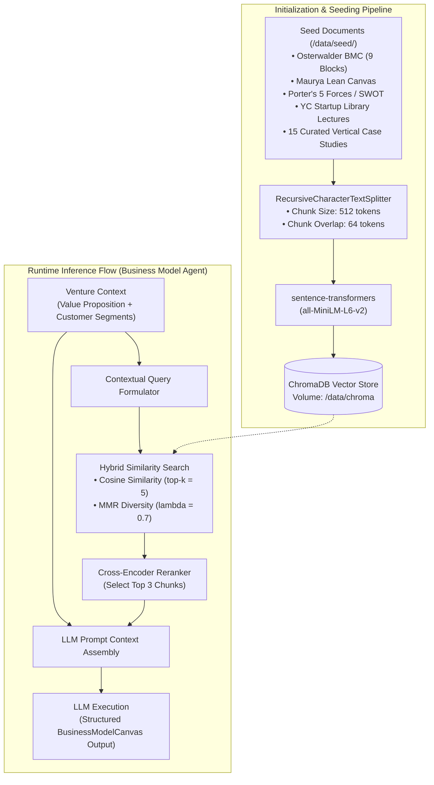

### 5.1 Corpus & Chunking Specification
* **Corpus Scope**:
  1. *Business Model Canvas Specification*: Theoretical definitions, relationships, and anti-patterns for all 9 canvas blocks.
  2. *Lean Canvas Framework*: Problem-solution fit, early adopter targeting, and unfair advantage criteria.
  3. *YC Startup Insights*: Selected lectures on pricing, distribution, customer validation, and unit economics.
  4. *Vertical Reference Case Studies*: 15 curated startup profiles across B2B SaaS, two-sided marketplaces, consumer apps, and fintech.
* **Embedding Model**: `sentence-transformers/all-MiniLM-L6-v2` (384-dimensional dense vectors, lightweight CPU inference).
* **Chunking Strategy**: 512 tokens with 64-token overlap, preserving header hierarchy metadata.
* **Retrieval Strategy**: Hybrid retrieval using cosine distance for initial candidates ($k=5$), followed by Maximal Marginal Relevance (MMR, $\lambda=0.7$) to ensure diversity, filtered through cross-encoder reranking to inject the top 3 most relevant passages.

### 5.2 Idempotent Startup Seeding
To eliminate manual setup friction across team members and CI pipelines:
* In `services/orchestrator/app/main.py`, the FastAPI `lifespan` handler checks ChromaDB collection cardinality on boot.
* If the collection contains 0 documents, it automatically triggers [`seed_vector_store.py`](file:///home/savindust/Documents/projects/ai-co-founder/ai-cofounder/services/business-intelligence/app/rag/seed_vector_store.py) against committed fixture files in `services/business-intelligence/data/seed/`.
* Persistent storage is maintained via the host volume mount `./data/chroma:/data/chroma`.

---

## 6. Deterministic Financial Engine

The financial engine lives in `services/finance/app/engine/` and adheres to a strict division of labor: **LLMs extract assumptions; Python executes math.**

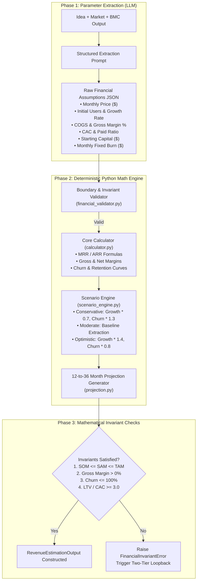

### 6.1 Mathematical Formulations
All monthly projections for month $m \in \{1, \dots, N\}$ are computed deterministically:

$$\text{Active Users}_m = \text{Active Users}_{m-1} \times (1 - \text{Churn Rate}) + \text{New Acquisitions}_m$$

$$\text{MRR}_m = \text{Active Users}_m \times \text{ARPU}_m$$

$$\text{ARR}_m = \text{MRR}_m \times 12$$

$$\text{Gross Profit}_m = \text{MRR}_m \times (1 - \text{COGS Rate})$$

$$\text{Net Burn}_m = (\text{Monthly Fixed OPEX} + (\text{New Acquisitions}_m \times \text{CAC})) - \text{Gross Profit}_m$$

$$\text{Runway (months)} = \frac{\text{Cash Reserve}_m}{\max(1, \text{Net Burn}_m)}$$

$$\text{LTV} = \frac{\text{ARPU} \times \text{Gross Margin \%}}{\text{Monthly Churn Rate}}$$

### 6.2 Hard Invariant Rules & Boundary Checks
The engine executes validation checks implemented in [`financial_validator.py`](file:///home/savindust/Documents/projects/ai-co-founder/ai-cofounder/services/finance/app/engine/financial_validator.py) and [`boundary_checks.py`](file:///home/savindust/Documents/projects/ai-co-founder/ai-cofounder/services/finance/app/engine/boundary_checks.py):
1. **Market Scale Invariant**: $\text{SOM} \le \text{SAM} \le \text{TAM}$ (A venture cannot capture more than its serviceable or total market).
2. **Economic Viability Invariant**: $\text{Gross Margin} > 0$ and $\frac{\text{LTV}}{\text{CAC}} \ge 3.0$ for venture-backed viability (or flag structural warning).
3. **Probability Boundaries**: $0.0 \le \text{Monthly Churn Rate} \le 1.0$; $0.0 \le \text{Conversion Rate} \le 1.0$.
4. **Non-Negative Constraints**: $\text{Price} \ge 0$, $\text{CAC} \ge 0$, $\text{Starting Capital} \ge 0$.

---

## 7. Shared Data Contracts & VentureState

All cross-domain data exchange relies on Pydantic v2 schemas in `shared/contracts/`. No agent has access to raw database sessions or external agent runtime states.

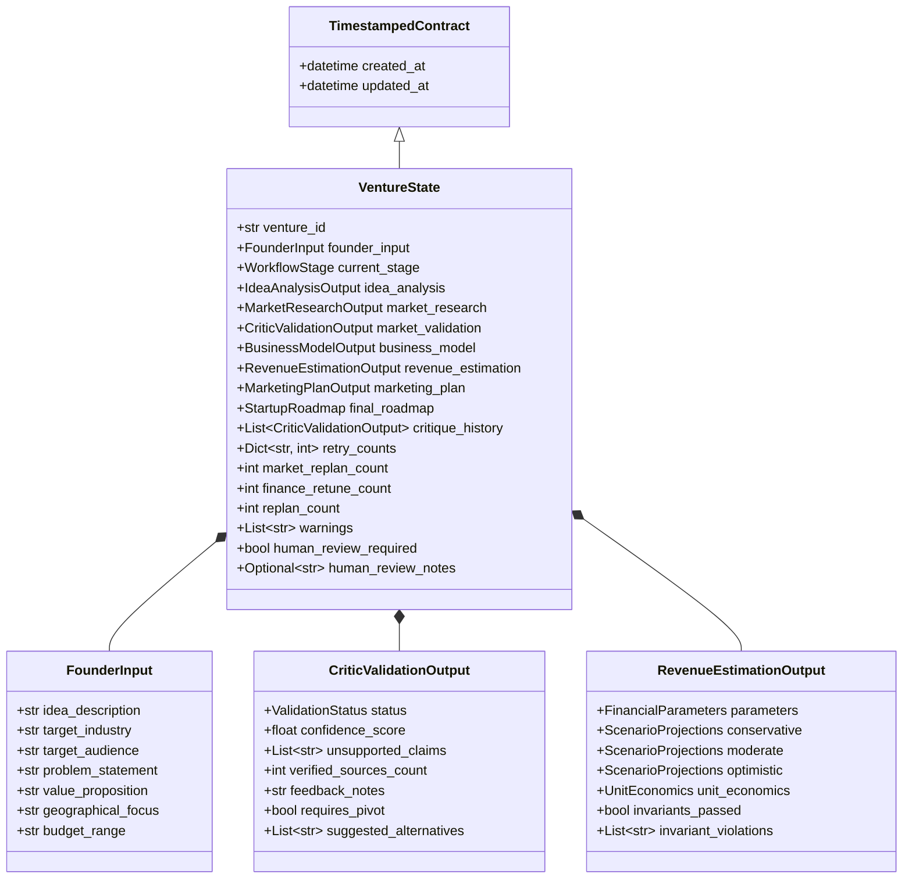

### 7.1 Key Schema Definitions
* **`VentureState`** ([`shared/contracts/venture_state.py`](file:///home/savindust/Documents/projects/ai-co-founder/ai-cofounder/shared/contracts/venture_state.py)): The unified blackboard object passed through all LangGraph nodes. Every node consumes slices of this state and returns an updated dictionary of fields merged by LangGraph.
* **`critique_history`**: A chronological record (`List[CriticValidationOutput]`) preserved across re-planning iterations to give agents visibility into previously rejected assumptions.
* **Multi-Tier Loop Counters**:
  * `market_replan_count`: Tracks critic-triggered research revisions (max 3).
  * `finance_retune_count`: Tracks internal revenue parameter retuning (max 2).
  * `replan_count`: Global pipeline replan counter (hard limit = 5).

---

## 8. Self-Healing, Re-planning & Human-in-the-Loop Protocol

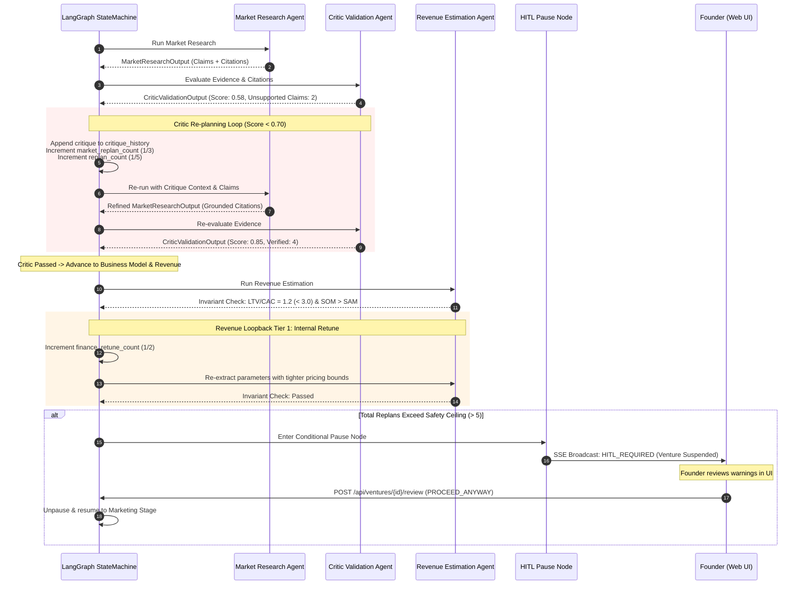

### 8.1 The Strict 3-Point Critic Rubric
The Critic agent evaluates Market Research output against three non-negotiable gates:
1. **Confidence Score Threshold**: $\text{confidence\_score} \ge 0.70$.
2. **Citation Grounding Count**: $\text{verified\_sources\_count} \ge 2$ valid external HTTP URLs for market size and competitor metrics.
3. **Zero High-Impact Unsupported Claims**: $\text{len}(\text{unsupported\_claims}) == 0$.

If any gate fails, `ValidationStatus` is marked `RESEARCH_REQUIRED` (for data deficits) or `REANALYSIS_REQUIRED` (if core problem-solution fit is contradictory).

### 8.2 Targeted Incremental Re-planning
Unlike naive multi-agent workflows that wipe state and restart the entire pipeline from scratch, the system performs **targeted replanning**:
* If Market Research fails validation, **Idea Analysis is NOT re-executed** unless `requires_pivot == True`. Only the `market_research_node` re-runs.
* If Revenue Estimation fails invariant checks:
  * **Tier 1 (Micro-Retune)**: Re-runs parameter extraction up to 2 times to find viable pricing/churn assumptions without touching market research.
  * **Tier 2 (Macro-Loopback)**: If 2 retunes fail, loops back to Market Research with specific financial notes (e.g., "CAC from customer segments produces unsustainable unit economics").

### 8.3 Anti-Oscillation via Critique History
A recurring failure mode in agentic loops is oscillation (Agent A adjusts to satisfy Critic, but in doing so violates another condition, toggling indefinitely). 
* The system preserves `VentureState.critique_history`.
* Re-planning prompts inject the entire sequence of previous reviews:
  > *"In iteration 1, you failed due to ungrounded TAM. In iteration 2, you fixed TAM but omitted competitor pricing. Do not revert to the claims from iteration 1 while fixing competitor pricing."*

### 8.4 Human-in-the-Loop (HITL) Resume API
When `total_replan_count > 5` or `ValidationStatus.REANALYSIS_REQUIRED` is triggered:
1. LangGraph routes execution to `human_review_node`, an interrupt/pause state.
2. The Orchestrator emits an SSE event `HITL_REQUIRED`.
3. The founder reviews the critique and discrepancy notes in the UI and submits an action via:

```http
POST /api/ventures/{venture_id}/review
Content-Type: application/json
Authorization: Bearer <jwt_token>

{
  "action": "PROCEED_ANYWAY" | "OVERRIDE_ASSUMPTIONS" | "ABORT",
  "notes": "Founder confirms acceptance of 15% estimated initial churn rate."
}
```

* **`PROCEED_ANYWAY`**: Appends founder note as an accepted risk warning, overrides critic block, and advances to the next stage.
* **`OVERRIDE_ASSUMPTIONS`**: Updates `founder_input` with revised assumptions and resumes pipeline execution.
* **`ABORT`**: Marks venture as `FAILED` with `human_review_notes` populated.

---

## 9. Failure Modes & Layered Resilience

```
+-----------------------------------------------------------------------------------------------+
|                                  LAYERED RESILIENCE ARCHITECTURE                              |
+--------------------------+-----------------------------+--------------------------------------+
| Layer 1: LLM Retries     | Layer 2: Search Fallbacks   | Layer 3: Process Isolation           |
| Exponential backoff with | 24-hr Redis cache; degraded | In-process try/except boundaries     |
| jitter (2s, 4s, 8s);     | mode with model knowledge;  | around each LangGraph node; 120-sec  |
| 3-provider fallback chain| MOCK_SEARCH fixture toggle. | node timeout; crash recovery from PG.|
+--------------------------+-----------------------------+--------------------------------------+
```

### 9.1 LLM Invocations & Provider Fallback
* **Retry Strategy**: Implemented in [`retry_handler.py`](file:///home/savindust/Documents/projects/ai-co-founder/ai-cofounder/services/orchestrator/app/orchestration/retry_handler.py) using exponential backoff with jitter:
  $$t_{\text{wait}} = 2^r + \text{uniform}(0, 1) \quad \text{for retry } r \in \{1, 2, 3\}$$
* **Provider Fallback Chain**: If the primary configured provider returns repeated 429 (rate-limit) or 5xx server errors, the client fails over sequentially:
  $$\text{Primary (e.g. OpenAI)} \longrightarrow \text{Fallback 1 (Anthropic)} \longrightarrow \text{Fallback 2 (Google Gemini)}$$
* **JSON Schema Enforcement**: If an LLM response fails Pydantic contract validation, the validation error string is injected into a one-shot correction prompt. Maximum 2 correction retries before failing the stage.

### 9.2 Search & Scraping Resiliency
* **Cache-First Architecture**: All external Tavily search queries are hashed and cached in Redis with a 24-hour TTL.
* **Graceful Degradation**: If the search provider is unreachable and no cache hit exists, the Market Research agent switches to degraded mode: model parametric knowledge is used, a warning flag is appended (`"Web search unavailable — unverified model estimates"`), and the Critic is informed of degraded mode to relax citation count requirements.

### 9.3 In-Process Node Isolation & Crash Recovery
* **Exception Sandboxing**: Every LangGraph node executes within a try/except boundary managed by [`failure_handler.py`](file:///home/savindust/Documents/projects/ai-co-founder/ai-cofounder/services/orchestrator/app/orchestration/failure_handler.py). An unhandled exception in one agent halts that specific branch and emits an error event without terminating the FastAPI process.
* **Execution Timeout**: Each node is wrapped with `asyncio.wait_for(timeout=120.0)`. Nodes running longer than 120 seconds are aborted and retried once before escalating.
* **Crash Recovery Protocol**: On Orchestrator startup, the system queries PostgreSQL for any ventures in non-terminal states (`current_stage NOT IN ('COMPLETED', 'FAILED')`). The state machine automatically restores the latest checkpointed snapshot from PostgreSQL and resumes execution from the interrupted stage.

---

## 10. State Persistence & Checkpointing

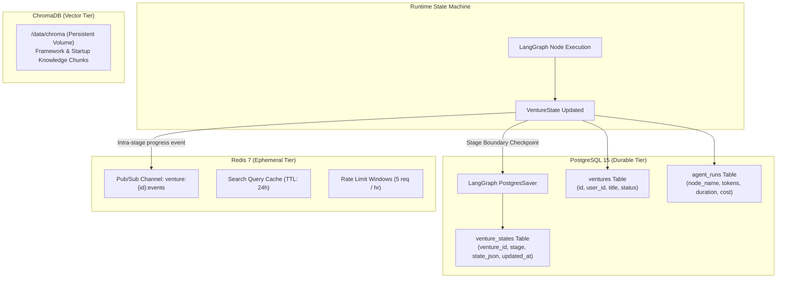

### 10.1 Persistence Split
* **PostgreSQL (Durable Source of Truth)**:
  * Checkpoints full `VentureState` snapshots at every major stage boundary.
  * Stores user credentials, multi-tenant ownership mappings, and immutable execution logs.
  * Survives full server crashes and restarts.
* **Redis (Ephemeral & Real-Time Tier)**:
  * Acts as the pub/sub message broker for Server-Sent Events.
  * Holds short-lived rate-limiting sliding windows.
  * Stores Tavily search results (24h TTL) to conserve API costs.
* **ChromaDB (Vector Tier)**:
  * Persistent file-backed storage mounted at `/data/chroma`.
  * Holds pre-computed embeddings for startup frameworks and reference case studies.

---

## 11. Real-Time Client Streaming (SSE)

Real-time feedback is critical for user experience during a 3–5 minute multi-agent execution pipeline. The platform implements a **Hydration + Stream** pattern over Server-Sent Events.

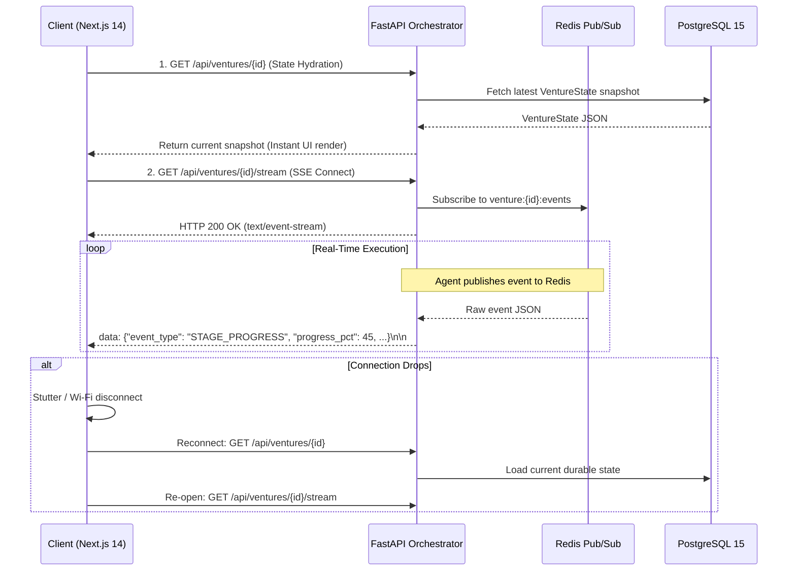

### 11.1 Standardized SSE Event Envelope
All events emitted over `/api/ventures/{venture_id}/stream` adhere to a uniform schema:

```json
{
  "event_type": "STAGE_STARTED" | "STAGE_PROGRESS" | "STAGE_COMPLETED" | "REPLAN_TRIGGERED" | "WARNING" | "HITL_REQUIRED" | "ROADMAP_READY",
  "venture_id": "9f8b7c6d-5e4a-3b2c-1d0e-f9a8b7c6d5e4",
  "stage": "MARKET_RESEARCH",
  "progress_pct": 65,
  "message": "Analyzing competitor pricing models for 4 direct rivals...",
  "data": {
    "competitors_found": 4,
    "citations_count": 6
  },
  "timestamp": "2026-09-05T21:20:00.000Z"
}
```

### 11.2 Client State Hydration
To eliminate event loss during browser reloads or network hiccups:
1. When [`useAgentStream.ts`](file:///home/savindust/Documents/projects/ai-co-founder/ai-cofounder/frontend/hooks/useAgentStream.ts) initializes, it first executes an HTTP `GET /api/ventures/{id}`.
2. The returned snapshot renders the completed stages immediately.
3. The hook then binds to `/api/ventures/{id}/stream` to consume real-time updates for the active stage.

---

## 12. Security & Authentication

### 12.1 Authentication & Multi-Tenancy
* **Auth Protocol**: JWT-based session tokens issued by the Orchestrator at `/api/auth/login`.
* **Multi-Tenant Isolation**: 
  * Every venture row in PostgreSQL contains an immutable `user_id` foreign key.
  * All database queries filter strictly by `WHERE venture_id = :id AND user_id = :current_user`.
  * The SSE endpoint validates the JWT token before binding to the venture's Redis event channel.
* **Secrets Protection**: External API keys (`OPENAI_API_KEY`, `ANTHROPIC_API_KEY`, `TAVILY_API_KEY`, `JWT_SECRET`) reside exclusively in server-side environment variables and are never transmitted to the client.
* **Rate Limiting**: Configured in Redis to enforce a ceiling of 5 venture pipeline starts per user per hour, preventing accidental credit exhaustion.
* **CORS Policy**: Configured in [`main.py`](file:///home/savindust/Documents/projects/ai-co-founder/ai-cofounder/services/orchestrator/app/main.py) to restrict allowed origins strictly to `FRONTEND_URL` in production environments.

---

## 13. Automated Evaluation Harness

The platform includes an automated evaluation harness located in [`evaluation/`](file:///home/savindust/Documents/projects/ai-co-founder/ai-cofounder/evaluation), providing reproducible benchmark scoring for research defense and system validation.

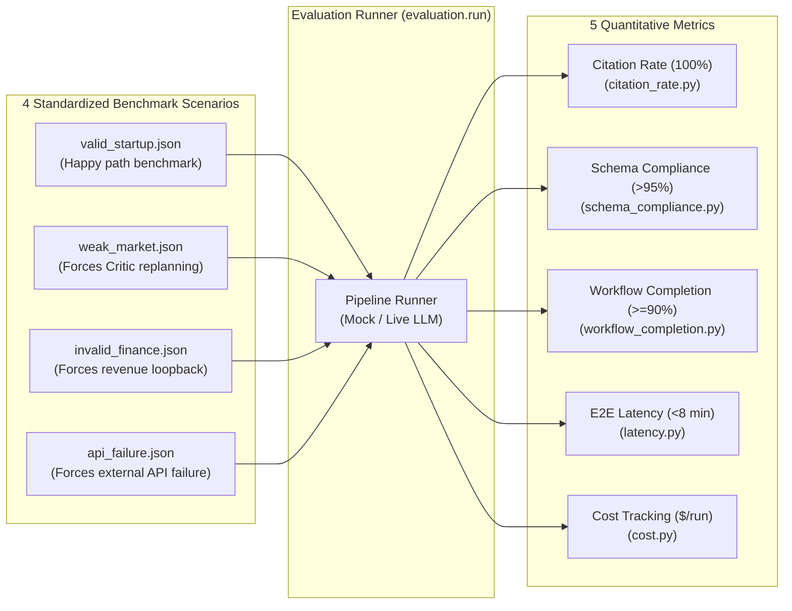

### 13.1 Evaluation Metrics & Benchmarks

| Metric | Source File | Mathematical Definition | Target Threshold | Rationale |
| :--- | :--- | :--- | :--- | :--- |
| **Citation Rate** | [`citation_rate.py`](file:///home/savindust/Documents/projects/ai-co-founder/ai-cofounder/evaluation/metrics/citation_rate.py) | $\frac{\text{verified\_external\_citations}}{\text{total\_factual\_market\_claims}}$ | **100%** | Zero hallucinated market statistics. |
| **Schema Compliance** | [`schema_compliance.py`](file:///home/savindust/Documents/projects/ai-co-founder/ai-cofounder/evaluation/metrics/schema_compliance.py) | $\frac{\text{valid\_pydantic\_contract\_outputs}}{\text{total\_agent\_invocations}}$ | **> 95%** | Rigorous structured output compliance. |
| **Workflow Completion** | [`workflow_completion.py`](file:///home/savindust/Documents/projects/ai-co-founder/ai-cofounder/evaluation/metrics/workflow_completion.py) | $\frac{\text{ventures\_reaching\_COMPLETED}}{\text{total\_ventures\_started}}$ | **$\ge$ 90%** | Resilient convergence without deadlocks. |
| **End-to-End Latency** | [`latency.py`](file:///home/savindust/Documents/projects/ai-co-founder/ai-cofounder/evaluation/metrics/latency.py) | $t_{\text{ROADMAP\_READY}} - t_{\text{POST\_START}}$ | **< 8 minutes** | Usable interactive user experience. |
| **Cost per Venture** | [`cost.py`](file:///home/savindust/Documents/projects/ai-co-founder/ai-cofounder/evaluation/metrics/cost.py) | $\sum (\text{tokens}_{\text{prompt}} \cdot c_p + \text{tokens}_{\text{comp}} \cdot c_c)$ | **Track & Report** | Cost visibility for academic budgets. |

### 13.2 Evaluation Scenarios
1. **`valid_startup.json`**: A well-formulated B2B SaaS startup concept with clear customer definitions. Asserts happy-path execution with zero re-plans.
2. **`weak_market.json`**: A concept with deliberately ungrounded market claims. Verifies that the Critic successfully flags the weakness and triggers a targeted research re-plan.
3. **`invalid_finance.json`**: A concept configured with contradictory pricing ($SOM > SAM$ or negative gross margins). Verifies the two-tier revenue loopback mechanism.
4. **`api_failure.json`**: A scenario running with simulated network errors to verify retry handlers, search cache fallbacks, and graceful degradation.

---

## 14. Testing Strategy & Mock Architecture

The codebase enforces a 4-tier testing pyramid to guarantee mathematical precision and pipeline stability:

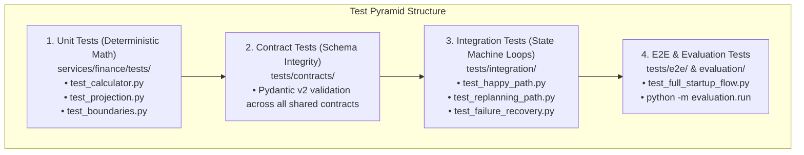

### 14.1 Test Execution Commands
* **Run Math Engine Unit Tests**:
  ```bash
  pytest services/finance/tests/ -v
  ```
* **Run Integration Pipeline Tests**:
  ```bash
  pytest tests/integration/ -v
  ```
* **Run Full End-to-End Test Suite**:
  ```bash
  pytest tests/e2e/ -v
  ```
* **Run Automated Evaluation Benchmark**:
  ```bash
  python -m evaluation.run
  ```

---

## 15. Repository Mapping & Team Development Workflow

To support concurrent engineering across 5 team members without merge friction, the repository maps strict domain boundaries:

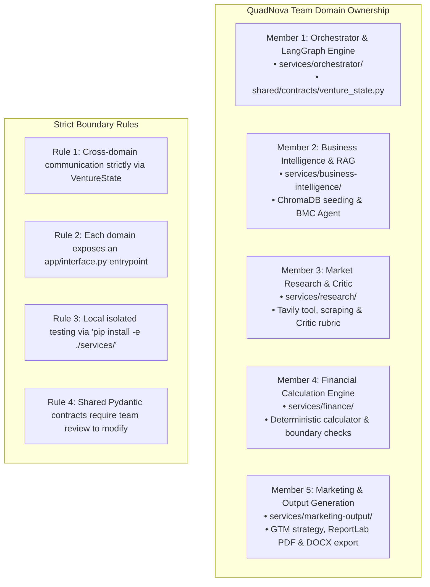

### 15.1 Directory-to-Domain Mapping

| Domain Directory | Team Responsibility | Primary Entrypoint | Isolated Unit Test Path |
| :--- | :--- | :--- | :--- |
| [`services/orchestrator`](file:///home/savindust/Documents/projects/ai-co-founder/ai-cofounder/services/orchestrator) | Orchestration, LangGraph StateGraph, API, SSE Stream | `app/main.py` | `tests/integration/` |
| [`services/business-intelligence`](file:///home/savindust/Documents/projects/ai-co-founder/ai-cofounder/services/business-intelligence) | Idea Analysis, ChromaDB Seeding, BMC Agent (RAG) | `app/interface.py` | `services/business-intelligence/tests/` |
| [`services/research`](file:///home/savindust/Documents/projects/ai-co-founder/ai-cofounder/services/research) | Market Research, Tavily Tooling, Critic Validation | `app/interface.py` | `services/research/tests/` |
| [`services/finance`](file:///home/savindust/Documents/projects/ai-co-founder/ai-cofounder/services/finance) | Parameter Extraction, Financial Calculator, Scenarios | `app/interface.py` | `services/finance/tests/` |
| [`services/marketing-output`](file:///home/savindust/Documents/projects/ai-co-founder/ai-cofounder/services/marketing-output) | GTM Strategy, Roadmap Synthesis, PDF/DOCX Exporters | `app/interface.py` | `services/marketing-output/tests/` |
| [`shared/contracts`](file:///home/savindust/Documents/projects/ai-co-founder/ai-cofounder/shared/contracts) | Shared Pydantic v2 data models (immutable contract) | N/A | `tests/contracts/` |
| [`frontend`](file:///home/savindust/Documents/projects/ai-co-founder/ai-cofounder/frontend) | Next.js 14 Dashboard, SSE Hooks, Interactive Canvas | `src/app/page.tsx` | `npm test` |

### 15.2 Developer Workflow & Local Isolation
Each domain developer can work locally without running Docker or dependent services:
```bash
# 1. Clone repository and set up virtual environment
python -m venv venv && source venv/bin/activate

# 2. Install shared contracts and the specific domain in editable mode
pip install -e ./shared
pip install -e ./services/finance

# 3. Execute domain tests in isolation with zero database dependencies
pytest services/finance/tests/
```

When integrating full pipeline changes, run the unified stack:
```bash
docker compose up --build
```
